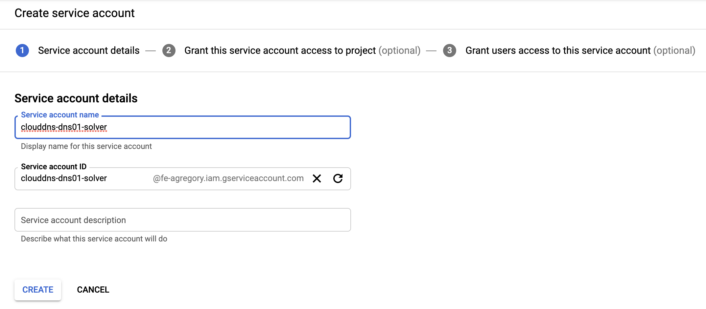
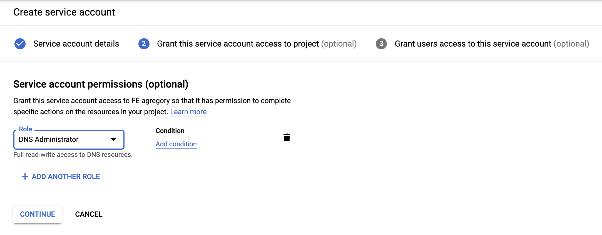
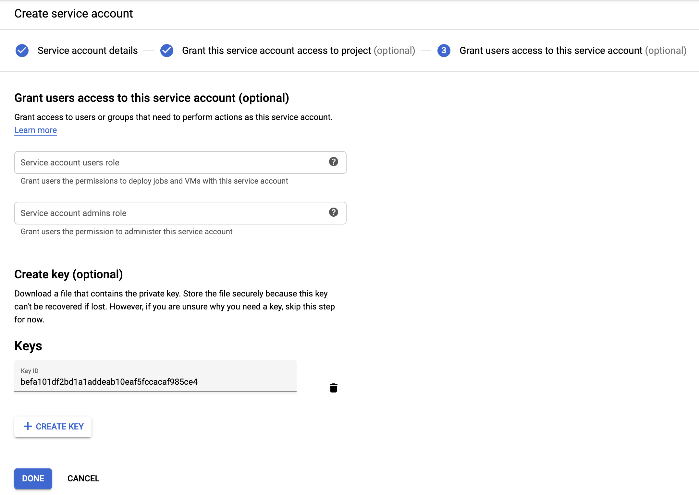

# Cert Manager Setup

Refer to the docs for [cert-manager](https://cert-manager.io/docs/installation/) for exact instructions for your platform.  Either Helm or directly work fine.

After installing the main product, there are a couple of options for challenge completion.  If you have set up DNS via Google Cloud DNS or Azure DNS, the following steps will work for integrating cert-manager within your cluster:

[Azure](#azure-dns)

[GCP](#gcp)
---------
# GCP

## Create GCP Service Account and Key

Create the service account, assign it to the *DNS Administrator* role, and generate a key, all in one workflow.  Download that key to your working directory.

### Screen shots




Save the resulting key somewhere good, and refer to it below as key.json



## Create a secret within kube cluster

The key needs to be added to the cluster in order for the cert-manager DNS01 solver to communicate with your GCP Cloud DNS zone:

```kubectl create secret generic clouddns-dns01-solver-svc-acct --from-file=key.json -n cert-manager```

## OPTIONAL: Use gcloud CLI to verify zone info during challenge process

Install gcloud CLI per instructions provided by Google.  Instead of logging in with your normal credentials, add the new service account and be logged in. Verify that the GCP Cloud DNS Zone ithat your FQDN to use is visible.  During the challenge phase, there will be a temporary TXT entry added, which will go away once cert-manager verifies that you own that FQDN.

## Set up the cert-manager DNS01 Solver

The following (with your email) YAML file needs to be added as a ClusterIssuer within your cluster:

### Command

```
agregory@jump:~/cert-manager$ k apply -f letsencrypt-prod-dns.yaml
clusterissuer.cert-manager.io/letsencrypt-prod created
```

### YAML

```yaml
apiVersion: cert-manager.io/v1alpha2
kind: ClusterIssuer
metadata:
  annotations:
  generation: 1
  name: letsencrypt-prod
spec:
  acme:
    email: your-email@xxx.yyy
    privateKeySecretRef:
      name: letsencrypt-prod
    server: https://acme-v02.api.letsencrypt.org/directory
    solvers:
    - dns01:
        cnameStrategy: Follow
        clouddns:
          project: fe-agregory
          serviceAccountSecretRef:
            name: clouddns-dns01-solver-svc-acct
            key: key.json
```

## Test the Issuer Process

This is recommended before running with cert-manager and the Helm chart Concourse install.  The easiest way to do this is to define a new FQDN in your zone and then create a "real" certificate for it using cert-manager.  Once this is successful, the same thing should happen behind the scenes via the ingress creation process.  To do this, create the new FQDN (IP is irrelevant for now), create the certificate YAML for it, apply the YAML file, then watch for completion.

### Create FQDN

Do this with the gcloud CLI:

```
agregory@jump:~/concourse-helm$ gcloud dns record-sets transaction start --zone gke-zone
Transaction started [transaction.yaml].
agregory@jump:~/concourse-helm$ gcloud dns record-sets transaction add "1.2.3.4" --name=test.gke.arg-pivotal.com --type=A --ttl=300 --zone=gke-zone
Record addition appended to transaction at [transaction.yaml].
agregory@jump:~/concourse-helm$ gcloud dns record-sets transaction execute --zone gke-zone
Executed transaction [transaction.yaml] for managed-zone [gke-zone].
Created [https://dns.googleapis.com/dns/v1/projects/fe-agregory/managedZones/gke-zone/changes/8].
ID  START_TIME                STATUS
8   2020-01-09T20:36:41.087Z  pending
agregory@jump:~/concourse-helm$ gcloud dns record-sets list --zone gke-zone|grep test
test.gke.arg-pivotal.com.          A     300    1.2.3.4
```

### Create certificate.yaml File

This is what we will apply to our cluster:

```
agregory@jump:~/concourse-helm$ vi test.gke.arg-pivotal.com
agregory@jump:~/concourse-helm$ cat test.gke.arg-pivotal.com
apiVersion: cert-manager.io/v1alpha2
kind: Certificate
metadata:
  name: test.gke.arg-pivotal.com
  namespace: default
spec:
  secretName: test-gke-tls
  issuerRef:
    kind: ClusterIssuer
    name: letsencrypt-prod
  commonName: test.gke.arg-pivotal.com
  dnsNames:
  - test.gke.arg-pivotal.com
agregory@jump:~/concourse-helm$ k apply -f test.gke.arg-pivotal.com
```

### Apply and Watch

As soon as the previous apply has come back, execute the following 2 commands to see the challenge happening.  You should see that the state is pending and that the certificate is not ready.g

```
agregory@jump:~/concourse-helm$ k get challenge,order,certificate
NAME                                                                                     STATE     DOMAIN                     AGE
challenge.acme.cert-manager.io/test.gke.arg-pivotal.com-444479332-989673484-2258748060   pending   test.gke.arg-pivotal.com   9s

NAME                                                                      STATE     AGE
order.acme.cert-manager.io/test.gke.arg-pivotal.com-444479332-989673484   pending   10s

NAME                                                   READY   SECRET                    AGE
certificate.cert-manager.io/test.gke.arg-pivotal.com   False   test-gke-tls              11s
```

and 

```
agregory@jump:~/concourse-helm$ gcloud dns record-sets list --zone gke-zone|grep test
test.gke.arg-pivotal.com.                  A     300    1.2.3.4
_acme-challenge.test.gke.arg-pivotal.com.  TXT   60     "IK17KFGV1gBa2DAn8rOhuN1brARPDx-zYcI22JyxGm0"
```

Wait a few moments and repeatedly execute the same command.  Within about 2 minutes, it should come back with the TXT entry gone, and with a certificate that is ready:

```
agregory@jump:~/concourse-helm$ gcloud dns record-sets list --zone gke-zone|grep test
test.gke.arg-pivotal.com.          A     300    1.2.3.4
agregory@jump:~/concourse-helm$ k get challenge,order,certificate

NAME                                                                      STATE   AGE
order.acme.cert-manager.io/test.gke.arg-pivotal.com-444479332-989673484   valid   2m33s

NAME                                                   READY   SECRET                    AGE
certificate.cert-manager.io/test.gke.arg-pivotal.com   True    test-gke-tls              2m35s
```

## Delete the certificate and DNS entry

Clean up after yourself, will 'ya?

```
agregory@jump:~/concourse-helm$ gcloud dns record-sets transaction start --zone gke-zone
Transaction started [transaction.yaml].
agregory@jump:~/concourse-helm$ gcloud dns record-sets transaction remove "1.2.3.4" --name=test.gke.arg-pivotal.com --type=A --ttl=300 --zone=gke-zone
Record removal appended to transaction at [transaction.yaml].
agregory@jump:~/concourse-helm$ gcloud dns record-sets transaction execute --zone gke-zone
Executed transaction [transaction.yaml] for managed-zone [gke-zone].
Created [https://dns.googleapis.com/dns/v1/projects/fe-agregory/managedZones/gke-zone/changes/11].
ID  START_TIME                STATUS
11  2020-01-09T20:53:17.434Z  pending
agregory@jump:~/concourse-helm$ gcloud dns record-sets list --zone gke-zone|grep test
agregory@jump:~/concourse-helm$
```

# Azure DNS

On Azure, you must create a DNS zone, then generate a service principal in order to talk to it.  Then generate a secret and refer to that in the **ClusterIssuer** that you create.

## Principal Generation

Commands to run from a shell where Azure CLI is set up (I am using 2.0.80)

```bash
AZURE_CERT_MANAGER_NEW_SP_NAME=azure-dns-sp
AZURE_DNS_ZONE_RESOURCE_GROUP=aks
AZURE_DNS_ZONE=aks.arg-pivotal.com
DNS_SP=$(az ad sp create-for-rbac --name $AZURE_CERT_MANAGER_NEW_SP_NAME)

AZURE_CERT_MANAGER_SP_APP_ID=$(echo $DNS_SP | jq -r '.appId')
AZURE_CERT_MANAGER_SP_PASSWORD=$(echo $DNS_SP | jq -r '.password')
AZURE_TENANT_ID=$(echo $DNS_SP | jq -r '.tenant')

az role assignment delete --assignee $AZURE_CERT_MANAGER_SP_APP_ID --role Contributor
DNS_ID=$(az network dns zone show --name $AZURE_DNS_ZONE --resource-group $AZURE_DNS_ZONE_RESOURCE_GROUP --query "id" --output tsv)
echo $DNS_ID
az role assignment create --assignee $AZURE_CERT_MANAGER_SP_APP_ID --role "DNS Zone Contributor" --scope $DNS_ID

echo "AZURE_CERT_MANAGER_SP_APP_ID: $AZURE_CERT_MANAGER_SP_APP_ID"
echo "AZURE_SUBSCRIPTION_ID: $AZURE_CERT_MANAGER_SP_PASSWORD"
echo "AZURE_TENANT_ID: $AZURE_TENANT_ID"
echo "AZURE_DNS_ZONE: $AZURE_DNS_ZONE"
echo "AZURE_DNS_ZONE_RESOURCE_GROUP: $AZURE_DNS_ZONE_RESOURCE_GROUP"
```
## Create a Secret

This secret needs to be there in order for it to work.  Do it while the environment variables are there.  Obviously, make sure you have the cluster in context.

```bash
kubectl create secret generic azuredns-config --from-literal=client-secret=$AZURE_CERT_MANAGER_SP_PASSWORD -n cert-manager
```

## Create ClusterIssuer
Create ClusterIssuer that looks like this:

```yaml
apiVersion: cert-manager.io/v1alpha2
kind: ClusterIssuer
metadata:
  annotations:
  generation: 1
  name: letsencrypt-prod-azure-dns
spec:
  acme:
    email: agregory@pivotal.io
    privateKeySecretRef:
      name: letsencrypt-prod
    server: https://acme-v02.api.letsencrypt.org/directory
    solvers:
    - dns01:
        azuredns:
          clientID: <REPLACE>
          clientSecretSecretRef:
          # The following is the secret we created in Kubernetes. Issuer will use this to present challenge to Azure DNS.
            name: azuredns-config
            key: client-secret
          subscriptionID: <REPLACE>
          tenantID: <REPLACE>
          resourceGroupName: <REPLACE>
          hostedZoneName: <REPLACE>
          # Azure Cloud Environment, default to AzurePublicCloud
          environment: AzurePublicCloud
```

Apply it.  

## Test it

Here is a test cert:

```yaml
apiVersion: cert-manager.io/v1alpha2
kind: Certificate
metadata:
  name: test.aks.arg-pivotal.com
  namespace: default
spec:
  secretName: test-aks-cert-tls
  issuerRef:
    kind: ClusterIssuer
    name: letsencrypt-prod-azure-dns
  commonName: test.aks.arg-pivotal.com
  dnsNames:
  - test.aks.arg-pivotal.com
```

Apply it and watch for the challenge (no errors):

```bash
PacMook-Bro-2:AKS agregory$ k apply -f test-azure-dns-cert.yaml
certificate.cert-manager.io/test.aks.arg-pivotal.com created

PacMook-Bro-2:AKS agregory$ k get challenge
NAME                                                        STATE     DOMAIN                     AGE
test.aks.arg-pivotal.com-3403757277-1068339460-4235686920   pending   test.aks.arg-pivotal.com   4s

PacMook-Bro-2:AKS agregory$ k describe challenge test.aks.arg-pivotal.com-3403757277-1068339460-4235686920
Name:         test.aks.arg-pivotal.com-3403757277-1068339460-4235686920

Events:
  Type    Reason     Age   From          Message
  ----    ------     ----  ----          -------
  Normal  Started    4s    cert-manager  Challenge scheduled for processing
  Normal  Presented  3s    cert-manager  Presented challenge using dns-01 challenge mechanism
```

Challenge on Azure in progress:


